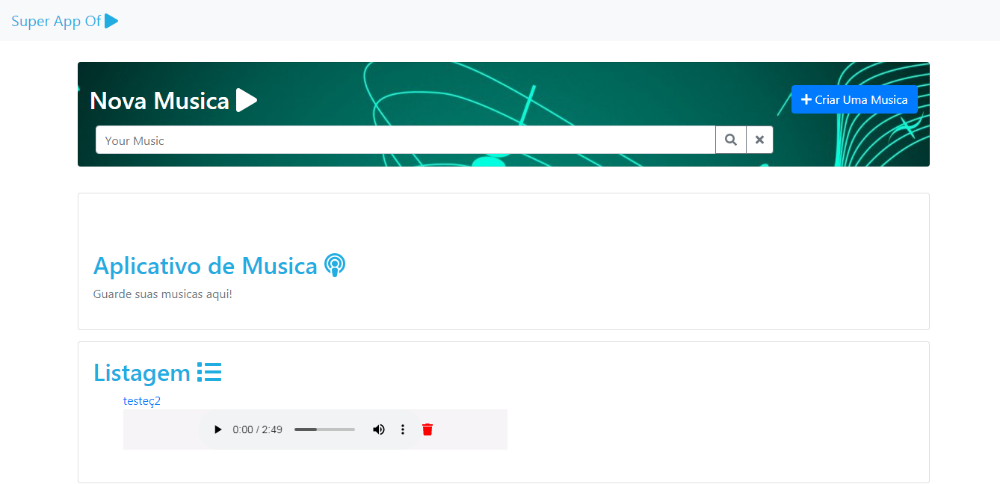
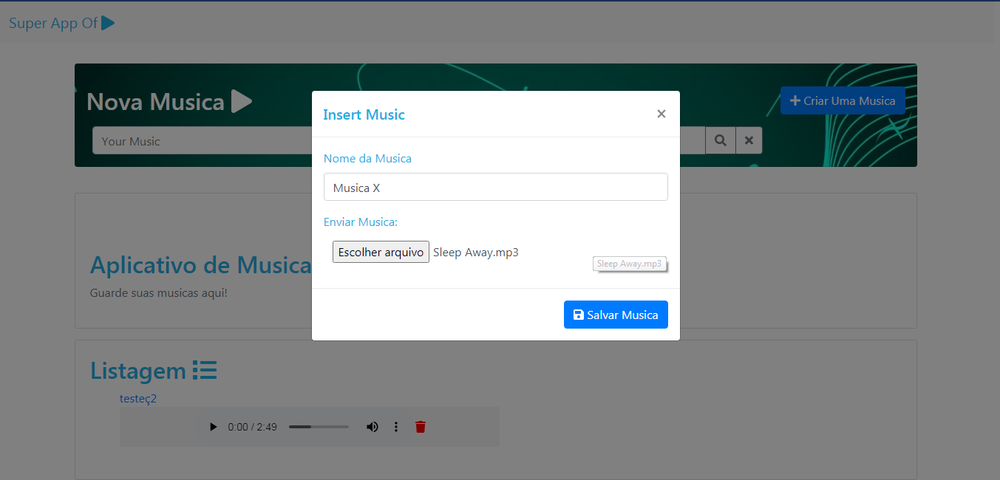
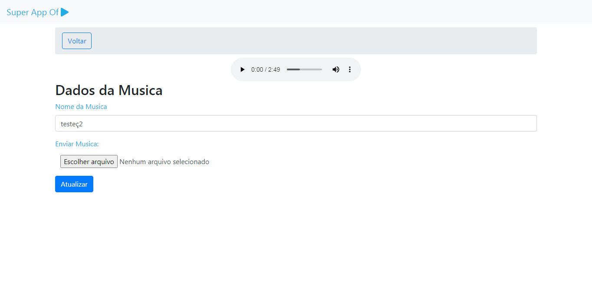
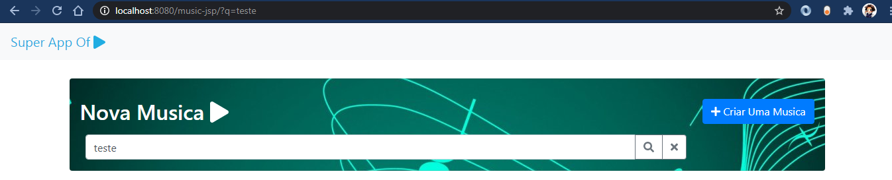
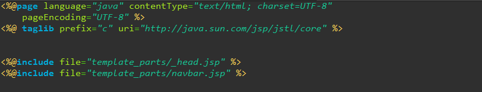
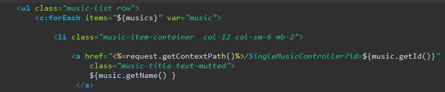

# O meu primeiro aplicativo em java web:

Tecnologias utilizadas:

- Java 8
- Mysql
- Servlet
- Hibernate
- Maven
- JSP
- Tomcat
- Bootstrap

# Tela Principal

Formulário para Inserção de musica

Formulário para Modificar Uma Música

# Buscador

**No aplicativo é possível:**

-   Inserir uma Música
-   Atualizar uma Música
-   Deletar uma Música
-   Listar uma Música
-   Ouvir uma Música
-   Baixar uma Música

# Aprendizados:

-   Criar uma aplicação no padrão MVC, no qual o servlet seria o
    controller o hibernate cuidaria da model e o jsp da view.

-   Foi aprendido como organizar cada parte do front end em um arquivo
    diferente para reuso.

-   Foi aprendido a utilizar o JPA com Hibernate

-   Foi possível conhecer como realizar uma transferência de arquivos
    entre browser e servidor.

Uso de tags para importação de arquivos

